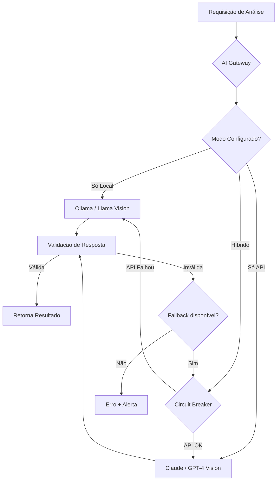
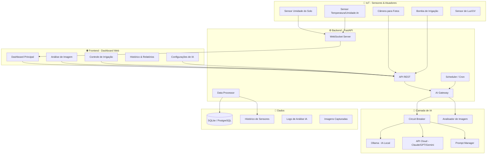

# PlantiuIA — Sistema Inteligente de IA para Agricultura

Sistema completo de IA para monitoramento agrícola, controle de irrigação e análise de saúde de plantas, inspirado no experimento **Sol Biodome** da Anthropic.

---

## Pesquisa e Contexto

### O Experimento Sol Biodome (Inspiração Principal)

O **Sol Biodome** foi um projeto experimental criado por Martin DeVido que colocou um tomateiro chamado "Sol" sob o **controle autônomo completo da IA Claude** da Anthropic. Principais pontos:

| Aspecto | Detalhes |
|:---|:---|
| **Objetivo** | Testar se uma IA poderia ser a cuidadora autônoma de uma planta, da semente à colheita, sem intervenção humana |
| **Ciclo de monitoramento** | A IA "acordava" a cada 15–30 minutos para analisar dados dos sensores e ajustar o ambiente |
| **Memória** | Arquitetura de memória em duas camadas — loops curtos de raciocínio + compressão periódica em resumos para manter contexto ao longo de meses |
| **Crise (Dia 34)** | Falha de hardware causou picos de temperatura e queda de umidade. Claude detectou a anomalia e corrigiu em 30 minutos, salvando a planta |
| **Sensores** | Temperatura do ar/folha, umidade relativa/VPD, CO₂, umidade do solo (múltiplas sondas), câmera visual |
| **Atuadores** | Luzes de crescimento, mantas térmicas, ventiladores, bomba d'água, umidificadores |
| **Resultado** | Planta levada com sucesso até a colheita |

### Estado da Arte — IA na Agricultura (2025-2026)

| Tecnologia | Status Atual |
|:---|:---|
| **Detecção de doenças por folha** | 96% de acurácia, usando CNNs e Vision Transformers |
| **Detecção pré-sintomática** | Análise de assinaturas espectrais dias/semanas antes de sintomas visuais |
| **Irrigação inteligente com IA** | Redução de 30-50% no uso de água vs. métodos tradicionais |
| **Edge Computing** | Modelos leves rodando em dispositivos móveis e IoT para diagnóstico em tempo real |
| **Previsão climática hiper-local** | Previsões de até 15 dias com precisão ao nível de campo |
| **IA Generativa como consultor** | Interação por linguagem natural para conselhos agronômicos personalizados |

### IA Local vs. API — Padrão de Failover

A pesquisa revelou padrões robustos para sistemas híbridos:



**Padrões recomendados:**
- **Retry com Exponential Backoff** — Para falhas transitórias (rate limit, glitches)
- **Circuit Breaker** — Após 3-5 falhas consecutivas, redireciona automaticamente para o fallback
- **Validação de resposta** — Verificar se a saída da IA é válida (JSON bem formado, conteúdo relevante)

---

## Decisões de Design para Aprovação

> [!IMPORTANT]
> ### Escolha da Stack Tecnológica
> A stack proposta é:
> - **Backend:** Python + FastAPI (assíncrono, ideal para IoT e streams de dados)
> - **Frontend/Dashboard:** HTML/CSS/JS puro com design premium (SPA sem framework pesado)
> - **Banco de dados:** SQLite (fase inicial) → PostgreSQL/TimescaleDB (produção)
> - **IA Local:** Ollama + Llama 3.2 Vision (análise de imagem) + modelos de texto
> - **IA via API:** Suporte a Claude API, OpenAI API, Google Gemini API
> - **IoT (futuro):** MQTT para comunicação com sensores ESP32/Arduino

> [!IMPORTANT]
> ### Escopo da Fase 1
> O sistema será inicialmente um **software de monitoramento e análise** (sem hardware IoT real na fase 1). Sensores serão simulados via interface web para demonstração e desenvolvimento. A integração com hardware real (ESP32, sensores, câmeras) será planejada como fase futura.

---

## Open Questions

> [!WARNING]
> 1. **Chaves de API**: Você já possui chaves de API da Anthropic (Claude), OpenAI ou Google? Qual provedor prefere como primário?
> 2. **Hardware IoT**: Você tem ou pretende adquirir ESP32/Arduino e sensores? Devemos focar no software primeiro?
> 3. **Tipo de cultura**: Qual safra/planta você pretende monitorar inicialmente? (tomate, café, soja, etc.) Isso afeta os modelos de análise.
> 4. **Idioma da interface**: A interface deve ser toda em português (PT-BR)?
> 5. **Deploy**: O sistema rodará localmente na sua máquina ou em um servidor/VPS?

---

## Arquitetura do Sistema



---

## Módulos Propostos

### Fase 1 — Core (MVP Completo)

#### 1. 🧠 AI Gateway — Sistema Inteligente de IA Dual

O coração do sistema. Gerencia múltiplos provedores de IA com failover inteligente.

**Modos de operação:**
| Modo | Descrição |
|:---|:---|
| `local_only` | Usa apenas Ollama (IA local). Sem dependência de internet |
| `api_only` | Usa apenas API na nuvem (Claude/GPT/Gemini) |
| `hybrid_prefer_api` | Prioriza API, faz fallback para local se API falhar |
| `hybrid_prefer_local` | Prioriza local, usa API para tarefas complexas |
| `smart_failover` | Circuit breaker automático — usa API, mas troca para local após falhas consecutivas |

#### 2. 🌱 Módulo de Análise de Saúde da Planta

- **Análise de folha individual** — Upload de foto da folha → IA analisa padrões de cor, textura, manchas
- **Análise da planta inteira** — Foto da planta completa → avaliação geral de saúde
- **Detecção de doenças** — Identificação de fungos, bactérias, deficiências nutricionais, pragas
- **Sugestões de tratamento** — IA sugere fertilizantes, pesticidas, ajustes de irrigação
- **Histórico visual** — Comparação de fotos ao longo do tempo para acompanhar evolução

#### 3. 💧 Módulo de Irrigação Inteligente

- **Monitoramento de umidade do solo** — Leitura em tempo real (simulada na fase 1)
- **Decisão automática de irrigação** — IA decide quando/quanto irrigar com base em:
  - Umidade atual do solo
  - Previsão do tempo (API meteorológica)
  - Tipo de planta e estágio de crescimento
  - Histórico de irrigação
- **Alertas** — Notificações de solo seco demais ou encharcado

#### 4. 📊 Dashboard Web Premium

- **Visão geral em tempo real** — Métricas de todos os sensores
- **Gráficos temporais** — Histórico de umidade, temperatura, saúde
- **Feed de análises** — Timeline das análises de IA com fotos e diagnósticos
- **Controles manuais** — Override de irrigação e ajustes
- **Design moderno** — Dark mode, glassmorphism, animações suaves

#### 5. ⚙️ Configurações e Administração

- **Configuração de provedores de IA** — Escolher modo, inserir API keys, configurar Ollama
- **Perfis de plantas** — Cadastro de safras com parâmetros ideais
- **Agendamento de análises** — Frequência de verificação automática
- **Logs e auditoria** — Registro de todas as decisões da IA

---

### Fase 2 — Expansão (Funcionalidades Avançadas)

#### 6. 🌦️ Integração Meteorológica
- API de previsão do tempo (OpenWeatherMap, etc.)
- Previsão de até 7 dias
- Correlação clima ↔ saúde da planta
- Alertas de geada, tempestade, seca

#### 7. 🐛 Detecção de Pragas
- Análise de imagem para identificar insetos e pragas
- Armadilhas inteligentes com câmera
- Sugestões de controle biológico e químico
- Histórico de infestações

#### 8. 📈 Analytics e Predição
- Previsão de colheita (yield prediction)
- Estimativa de crescimento
- Análise de produtividade por zona
- Recomendação de plantio (melhores culturas para o solo/clima)

#### 9. 🤖 Agente Autônomo (Estilo Sol Biodome)
- Modo "piloto automático" — IA gerencia toda a fazenda/horta
- Loops de decisão a cada 15-30 minutos
- Sistema de memória persistente (resumos comprimidos)
- Gestão de crises (detecção e correção automática de anomalias)
- Log de raciocínio (explicação das decisões tomadas)

---

### Fase 3 — Integração IoT Real

#### 10. 📡 Hardware e Sensores
- Integração com ESP32 via MQTT
- Sensores: umidade do solo, DHT22, luminosidade, UV, pH
- Câmera automatizada (ESP32-CAM ou Raspberry Pi)
- Bomba de irrigação controlada remotamente
- Sistema de alarme (temperatura crítica, falta d'água)

---

## Sugestões Adicionais de Funcionalidades

Com base na pesquisa, estas funcionalidades adicionais deixariam o sistema muito mais completo:

| Funcionalidade | Descrição | Impacto |
|:---|:---|:---|
| **Análise de solo** | Upload de foto do solo + dados de pH/nutrientes → IA recomenda correções | Alto |
| **Calendário agrícola inteligente** | IA sugere datas ideais de plantio, poda, colheita baseado no clima local | Alto |
| **Busca semântica de imagens** | "Mostre todas as fotos de folhas com manchas amarelas" — busca por linguagem natural | Médio |
| **Relatórios PDF/Email** | Geração automática de relatórios semanais/mensais | Médio |
| **Multi-fazenda** | Suporte a múltiplas áreas/zonas de cultivo | Alto |
| **App mobile (PWA)** | Dashboard acessível pelo celular como app | Alto |
| **Alertas por WhatsApp/Telegram** | Notificações urgentes por messaging | Médio |
| **Detecção de estresse hídrico** | Análise visual de murcha, enrolamento de folhas | Alto |
| **Mapa de calor da plantação** | Visualização georreferenciada de saúde por área | Médio |
| **Comparação A/B de tratamentos** | Testar dois tratamentos diferentes e comparar resultados via IA | Médio |
| **Integração com drones** | Receber imagens de drone para análise em massa | Baixo (fase futura) |
| **Base de conhecimento local** | RAG (Retrieval-Augmented Generation) com manuais e publicações agronômicas | Alto |

---

## Estrutura Proposta do Projeto

```
PlantiuIA/
├── backend/
│   ├── main.py                    # Entry point FastAPI
│   ├── config.py                  # Configurações globais
│   ├── requirements.txt           # Dependências Python
│   ├── api/
│   │   ├── routes/
│   │   │   ├── analysis.py        # Endpoints de análise de imagem
│   │   │   ├── irrigation.py      # Endpoints de irrigação
│   │   │   ├── sensors.py         # Endpoints de sensores
│   │   │   ├── dashboard.py       # Endpoints do dashboard
│   │   │   └── settings.py        # Endpoints de configuração
│   │   └── middleware/
│   │       ├── auth.py            # Autenticação (futuro)
│   │       └── cors.py            # CORS config
│   ├── core/
│   │   ├── ai_gateway.py          # Gateway unificado de IA
│   │   ├── circuit_breaker.py     # Circuit Breaker pattern
│   │   ├── prompt_manager.py      # Templates de prompts
│   │   └── memory_manager.py      # Memória persistente da IA
│   ├── models/
│   │   ├── database.py            # Modelos do banco
│   │   ├── schemas.py             # Schemas Pydantic
│   │   └── enums.py               # Enumerações
│   ├── services/
│   │   ├── analysis_service.py    # Lógica de análise
│   │   ├── irrigation_service.py  # Lógica de irrigação
│   │   ├── weather_service.py     # Integração meteorológica
│   │   ├── sensor_service.py      # Processamento de sensores
│   │   └── scheduler_service.py   # Tarefas agendadas
│   ├── providers/
│   │   ├── ollama_provider.py     # Provedor IA local (Ollama)
│   │   ├── claude_provider.py     # Provedor Anthropic Claude
│   │   ├── openai_provider.py     # Provedor OpenAI
│   │   └── gemini_provider.py     # Provedor Google Gemini
│   └── data/
│       ├── plantiu.db             # Banco SQLite
│       └── uploads/               # Imagens enviadas
├── frontend/
│   ├── index.html                 # Página principal
│   ├── css/
│   │   └── styles.css             # Design system completo
│   ├── js/
│   │   ├── app.js                 # Lógica principal
│   │   ├── dashboard.js           # Dashboard controller
│   │   ├── analysis.js            # Módulo de análise
│   │   ├── irrigation.js          # Módulo de irrigação
│   │   ├── settings.js            # Módulo de configurações
│   │   └── api.js                 # Cliente API
│   └── assets/
│       ├── icons/                 # Ícones SVG
│       └── images/                # Imagens estáticas
├── docs/
│   ├── API.md                     # Documentação da API
│   ├── SETUP.md                   # Guia de instalação
│   └── ARCHITECTURE.md            # Documentação da arquitetura
├── tests/
│   ├── test_ai_gateway.py         # Testes do gateway IA
│   ├── test_analysis.py           # Testes de análise
│   └── test_irrigation.py         # Testes de irrigação
├── .env.example                   # Template de variáveis de ambiente
├── .gitignore
├── README.md                      # Documentação principal
└── docker-compose.yml             # Setup Docker (futuro)
```

---

## Stack Tecnológica Detalhada

| Camada | Tecnologia | Justificativa |
|:---|:---|:---|
| **Backend** | Python 3.11+ / FastAPI | Async nativo, ideal para IoT, tipagem forte, documentação auto-gerada |
| **Servidor ASGI** | Uvicorn | Alta performance, suporte WebSocket |
| **Banco de Dados** | SQLite (dev) → PostgreSQL (prod) | Zero config inicial, migração fácil |
| **ORM** | SQLAlchemy + Alembic | Mapeamento objeto-relacional + migrações |
| **IA Local** | Ollama | Execução local de LLMs, suporte a modelos Vision |
| **Modelos Locais** | Llama 3.2 Vision (11B/90B) | Melhor modelo vision open-source disponível |
| **APIs de IA** | Anthropic, OpenAI, Google | Redundância e qualidade superior para análises complexas |
| **Processamento de Imagem** | Pillow, OpenCV | Pré-processamento de imagens antes da análise |
| **Frontend** | HTML5 + CSS3 + JavaScript Vanilla | Leve, sem dependências, design premium |
| **Gráficos** | Chart.js ou ApexCharts | Visualizações interativas de dados |
| **Comunicação real-time** | WebSocket | Dados de sensores em tempo real |
| **Agendamento** | APScheduler | Análises periódicas automáticas |
| **IoT (futuro)** | MQTT (paho-mqtt) | Protocolo leve para comunicação com ESP32 |
| **Meteorologia** | OpenWeatherMap API | Previsão do tempo gratuita |

---

## Plano de Verificação

### Testes Automatizados
- Testes unitários com `pytest` para o AI Gateway, Circuit Breaker, e serviços
- Testes de integração para endpoints da API
- Testes de fallover simulando falha de provedores de IA

### Verificação Manual
- Testar upload de imagens de folhas e verificar análise da IA
- Validar dashboard no navegador (design, responsividade, gráficos)
- Testar alternância entre modos de IA (local/api/híbrido)
- Simular dados de sensores e verificar decisões de irrigação
- Testar circuit breaker desconectando Ollama ou removendo API key
